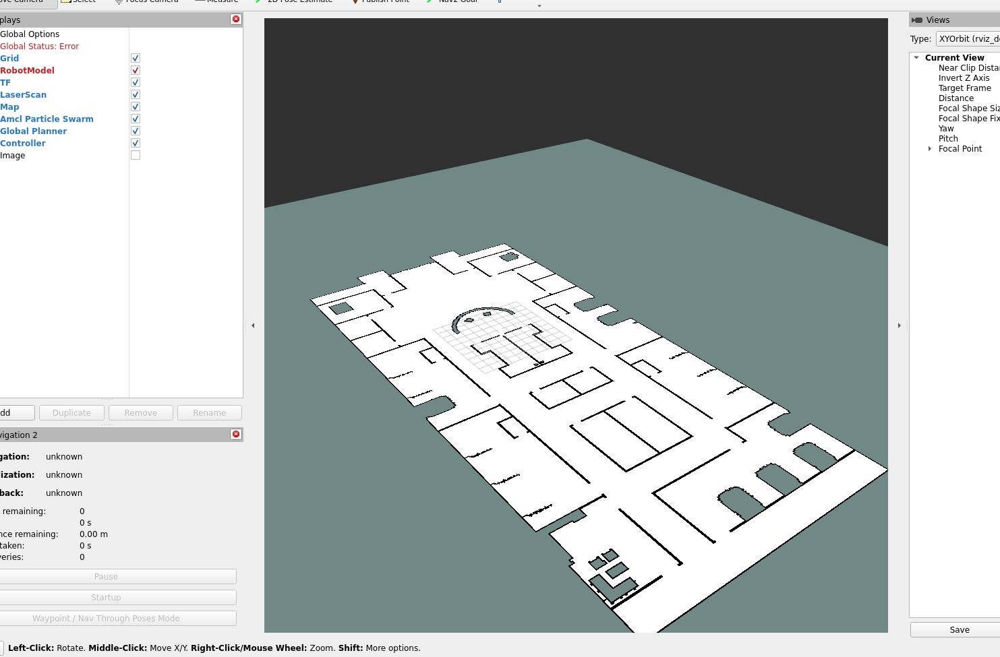
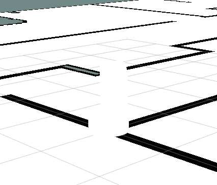
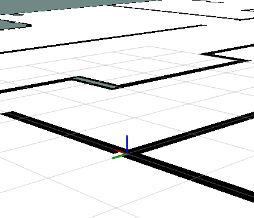

# Práctica: Hospital Patrolling con MERLIN2 y YASMIN

Este paquete implementa una misión de patrullaje en un entorno hospitalario simulado utilizando el robot RB1. El desarrollo se basa en la arquitectura cognitiva **MERLIN2**, haciendo uso de **YASMIN** para la máquina de estados y **KANT** para la planificación de tareas.

## Objetivo 
El robot RB1 debe patrullar cinco *Stretcher Rooms* (habitaciones de camillas) dentro del hospital de AWS Robomaker. En cada habitación, el robot debe:
1. Navegar hasta la coordenada específica.
2. Girar sobre sí mismo (360 grados).
3. Notificar (avisar mediante log/consola) que ha terminado de patrullar esa habitación.

---

## Arquitectura y Archivos del Paquete

Para cumplir con el diseño de la arquitectura cognitiva, el proyecto se divide en diferentes capas. A continuación se detalla qué archivos componen cada capa y por qué se han creado:

### 1. Reactive Layer (Capa Reactiva)
Esta capa maneja la interacción directa con los sensores y actuadores, además de la navegación pura (Nav2).
* **`params/stretcher_room_waypoints.yaml`**
  * **Qué es:** Un archivo de configuración de parámetros.
  * **Por qué:** Necesitamos decirle a la capa reactiva (y a nuestro sistema) cuáles son las coordenadas `(x, y, theta)` exactas de las 5 Stretcher Rooms en el mapa del hospital. Almacenarlo aquí permite cambiar las coordenadas sin tocar el código.

### 2. KANT / Planificación (Dominio y Problema)
Antes de ejecutar acciones, el robot necesita "pensar" cuál es el plan óptimo para visitar todas las habitaciones.
* **`merlin2_hospital_patrolling/pddl.py`** (o archivos `domain.pddl` / `problem.pddl`)
  * **Qué es:** La definición del mundo lógico del robot.
  * **Por qué:** El **dominio** define las acciones que el robot puede hacer lógicamente (ej. `move`, `patrol_room`). El **problema** define el estado inicial (el robot está en el pasillo) y el objetivo (las 5 habitaciones tienen el estado `patrolled`). KANT usa esto para generar un plan de alto nivel.

### 3. Executive Layer (Capa Ejecutiva)
Esta capa es el puente entre el plan lógico (KANT) y el control físico (Reactive Layer). Aquí es donde brilla **YASMIN**.
* **`merlin2_hospital_patrolling/merlin2_room_patrol_fsm_action.py`**
  * **Qué es:** La Máquina de Estados Finitos (FSM) que define el comportamiento del robot.
  * **Por qué:** Cuando el planificador dice "patrulla la habitación 1", esta capa desglosa esa orden en estados concretos. Aquí se crean los estados de YASMIN:
    1. `Maps_STATE`: Envía el objetivo a Nav2.
    2. `ROTATE_STATE`: Publica comandos de velocidad en `/cmd_vel` para girar.
    3. `ANNOUNCE_STATE`: Imprime el mensaje de éxito.

### 4. Mission Layer (Capa de Misión)
El "cerebro" principal que orquesta todo el proceso.
* **`merlin2_hospital_patrolling/merlin2_room_patrol_mission_node.py`**
  * **Qué es:** El nodo principal de ROS 2 que dispara la ejecución.
  * **Por qué:** Este archivo se encarga de leer los waypoints, conectarse a KANT para pedir el plan de patrullaje, y luego ir enviando cada meta a la Executive Layer (la máquina de estados de YASMIN) para que el robot se mueva. Controla que toda la misión global se cumpla.

### 5. Lanzamiento (Launch)
* **`launch/hospital_patrolling.launch.py`**
  * **Qué es:** El archivo de despliegue.
  * **Por qué:** Para no tener que abrir 5 terminales distintas. Este archivo arranca el nodo de la misión, carga los parámetros YAML y, si es necesario, levanta los servidores de acción de YASMIN y KANT en un solo paso.

---

##  Cómo ejecutar la práctica

Para probar la práctica, es necesario abrir dos terminales dentro del contenedor Docker.

### Terminal 1: Simulador (Gazebo y RViz)
Lanza el entorno 3D del hospital y el robot:

```bash
source /opt/ros/humble/setup.bash
source /root/ros2_ws/install/setup.bash
ros2 launch rb1_sandbox hospital.launch.py




El robot, en blanco 





```

### Terminal 2: Nodos de Misión
Tras compilar el espacio de trabajo, ejecuta el coordinador y la máquina de estados:

```bash
source /opt/ros/humble/setup.bash
source /root/ros2_ws/install/setup.bash
source install/setup.bash
ros2 launch merlin2_hospital_patrolling hospital_patrolling.launch.py
```

### Comportamiento del Sistema
1. **Inicialización:** `mission_node` lee las coordenadas de las 5 *Stretcher Rooms* desde el archivo `stretcher_room_waypoints.yaml`.
2. **Asignación:** Se envía la primera coordenada al `patrol_action_node` como un *Action Goal*.
3. **Navegación:** La máquina de estados (YASMIN) procesa la orden y usa *Nav2* para mover al robot sorteando obstáculos.
4. **Bucle de Patrulla:** Al alcanzar el destino (resultado `SUCCESS`), el nodo de misión asigna la siguiente habitación, repitiendo el ciclo hasta visitar los 5 puntos.
EOF