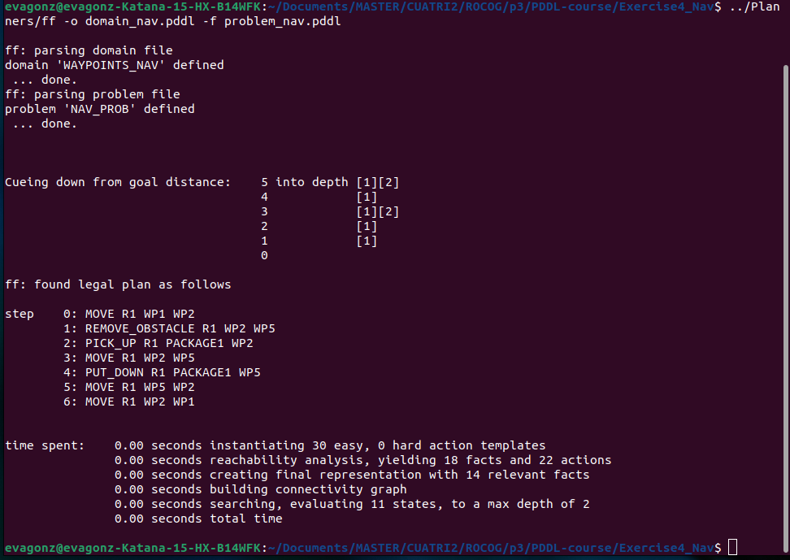
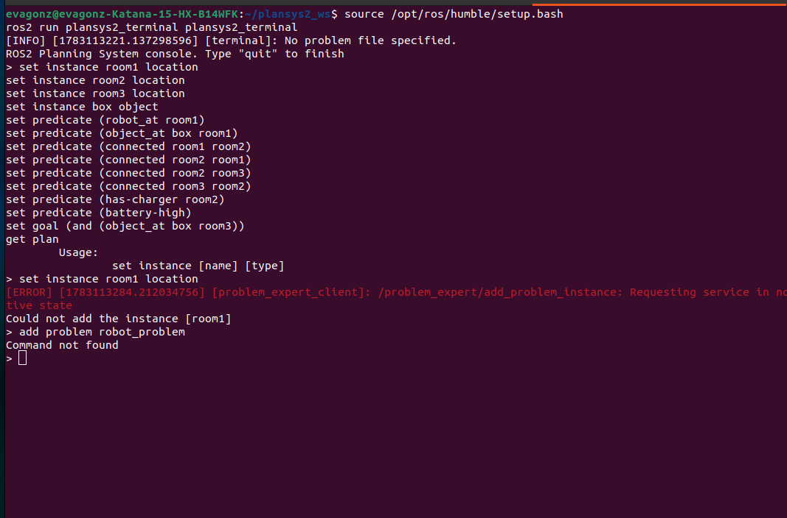

# Respuestas a la Práctica 2 de PDDL

## 1. Análisis de dominio simple

### Ejercicio 1: Basic Planning Exercise with Robots and Objects
En este ejercicio se modela un problema clásico de transporte de objetos utilizando robots. 
Las acciones disponibles son:
- **`move`**: Permite a un robot desplazarse entre dos localizaciones. Es fundamental para posicionar a los robots donde se encuentran los objetos o donde deben ser depositados.
- **`pick_up`**: Permite a un robot recoger un objeto que se encuentra en la misma localización. Su utilidad es cargar el objeto para transportarlo.
- **`put_down`**: Permite a un robot soltar un objeto que lleva consigo en la localización actual, necesario para alcanzar los objetivos de depositar objetos en lugares específicos.
- **`visit`**: Una acción de demostración que usa precondiciones disyuntivas para visitar localizaciones.
**Utilidad:** La combinación de `move`, `pick_up`, `move` (hacia el destino) y `put_down` permite transportar objetos en el entorno y alcanzar el estado objetivo.

### Ejercicio 2: Durative Actions Robot Navigation
Este dominio introduce acciones durativas (continuas en el tiempo) y funciones numéricas para modelar la navegación de un robot teniendo en cuenta la distancia y la velocidad.
Las acciones disponibles son:
- **`drive` (durative-action)**: Inicia y mantiene el movimiento del robot entre dos puntos conectados (`link`), incrementando continuamente la distancia recorrida (`distanceTravelled`) en función de su velocidad (`speed`). Permite simular el paso del tiempo y el recorrido espacial.
- **`arrive` (action)**: Se ejecuta instantáneamente cuando la distancia recorrida por el robot iguala o supera la distancia entre los dos puntos de su navegación actual, marcando su llegada al destino y deteniendo el estado `navigating`.
- **`visitChargingStation` (action)**: Permite simular una recarga o servicio para el robot siempre que haya recorrido una distancia mínima (entre 10 y 20).
**Utilidad:** Juntas, `drive` y `arrive` modelan un desplazamiento realista donde el tiempo y las métricas continuas son necesarias para alcanzar el destino del problema.

## 2. Extensión del dominio

He elegido extender el dominio base simple (`Exercise1_G`) añadiendo una nueva acción llamada `pass_object`. Esta acción permite a dos robots intercambiar un objeto. Para forzar su uso, también he añadido los predicados `(mobile ?r - robot)` y `(can-lift ?r - robot ?o - object)`.

- **Nueva acción**: `pass_object` requiere que dos robots estén en la misma localización. El robot que entrega el objeto (que actualmente lo sujeta) se lo pasa al segundo robot (que pasa a sujetarlo).
- **Ajuste del problema**: Se configuró para que `robot1` esté fijo (no móvil) en `loc1` y sea el único capaz de levantar `box1`. Para llevar `box1` a la meta (`loc2`), `robot1` la tiene que recoger y usar `pass_object` para dársela al `robot2`, que sí es móvil y puede llevarla a `loc2`.
- **Plan generado**: El planificador `ff` encontró exitosamente un plan de 8 pasos, destacando el paso `4: PASS_OBJECT ROBOT1 ROBOT2 BOX1 LOC1` que prueba la correcta integración de la acción extendida. El dominio y el problema extendidos están guardados en el repositorio bajo los nombres `domain_ext.pddl` y `problem_ext.pddl`.

## 3. Integración de PDDL en entorno simulado

Al carecer de un simulador 3D visual como Gazebo u otra interfaz gráfica para los ejercicios iniciales, la "visualización" se realiza analizando la salida secuencial del planificador `ff` para el problema extendido (paso a paso), lo cual representa la ejecución simulada del comportamiento de los robots:

1. **`PICK_UP ROBOT1 BOX1 LOC1`**: El robot 1, al ser el único capaz de levantar la caja 1, emplea sus actuadores para recoger el objeto en su posición actual. En una simulación observable, veríamos al brazo robótico de Robot1 agarrar `Box1`.
2. **`MOVE ROBOT2 LOC2 LOC3`**: Robot 2 se traslada del punto 2 al 3. Conceptualmente, inicia su locomoción, siguiendo un mapa de nodos o coordenadas.
3. **`PICK_UP ROBOT2 BOX2 LOC3`**: Robot 2 levanta la caja 2 de la localización 3.
4. **`MOVE ROBOT2 LOC3 LOC1`**: Robot 2 se dirige de la localización 3 a la 1, llevando consigo la caja 2. Observaríamos una trayectoria a través de los waypoints.
5. **`PASS_OBJECT ROBOT1 ROBOT2 BOX1 LOC1`**: Al estar ambos en `Loc1`, Robot1 transfiere `Box1` a Robot2, un comportamiento complejo de coordinación multi-robot, requiriendo que los robots sincronicen sus manipuladores o compartimentos de carga.
6. **`PUT_DOWN ROBOT2 BOX2 LOC1`**: Robot2 deposita `Box2` en el suelo (alcanzando el objetivo de que box2 esté en loc1).
7. **`MOVE ROBOT2 LOC1 LOC2`**: Robot2 viaja hacia la localización final 2.
8. **`PUT_DOWN ROBOT2 BOX1 LOC2`**: Robot 2 deja `Box1` en la localización 2, solventando el objetivo para box1 y culminando la misión.

Esta traza de plan refleja de un modo realista y observable el orden causal que el entorno simulado del robot deberá implementar a través de sus controladores físicos (navegación y manipulación).

## 4. Aplicación final: navegación entre waypoints (PDDL)

He diseñado un Dominio (`domain_nav.pddl`) y Problema (`problem_nav.pddl`) de navegación donde el robot viaja entre waypoints (`wp1` a `wp5`). 
- **Extras incluidos:** 
  - **Obstáculos**: Representados lógicamente por carecer de la proposición `(clear ?wp)`. El robot dispone de la acción `remove_obstacle`, que solo puede usar si está en un nodo adyacente y tiene el actuador libre `(hand-empty)`.
  - **Estados del robot**: `holding` vs `hand-empty`.
- **Estructura del problema**: El robot `r1` inicia en `wp1`, debe recoger `package1` en `wp2` y llevarlo a `wp5`. El camino directo entre `wp2` y `wp5` tiene un obstáculo. 

**Plan generado:**
0. `MOVE R1 WP1 WP2`: Se dirige al paquete.
1. `REMOVE_OBSTACLE R1 WP2 WP5`: Como aún tiene las manos libres, retira el obstáculo en la vía directa a wp5.
2. `PICK_UP R1 PACKAGE1 WP2`: Recoge el paquete.
3. `MOVE R1 WP2 WP5`: Viaja por la ruta que acaba de despejar.
4. `PUT_DOWN R1 PACKAGE1 WP5`: Deposita el paquete (cumpliendo ese objetivo).
5. `MOVE R1 WP5 WP2`
6. `MOVE R1 WP2 WP1`: Retorna al punto de partida (cumpliendo el objetivo del robot).

Esta secuencia supera los 3 movimientos mínimos y ha demostrado que el planificador gestiona correctamente las interdependencias entre estados del robot y el entorno (no habría podido retirar el obstáculo si primero recogía la caja). Los archivos se guardarán en la carpeta `Exercise4_Nav`.

## 5. Actividad Práctica (Sesión 4)

El objetivo es ampliar el dominio y problema proporcionados ("robot_transport") para incluir una tercera sala (transitaria) y una condición de límite de batería con la respectiva recarga. Estos ficheros se han alojado en `Exercise5_Session4`.

**Justificación de las modificaciones de modelado:**
- **Condición de energía**: Para evitar usar planificadores numéricos pesados (Numeric Fluents), se optó por un modelado eficiente en PDDL clásico (*STRIPS*) empleando estados lógicos: `(battery-high)` y `(battery-low)`. Esto es suficiente para forzar respostajes. Toda acción `move` requiere que la batería esté alta, consumiéndola y dejándola en `(battery-low)`.
- **Estación de carga**: Se añadió un nuevo predicado inmutable `(has-charger ?l)` para indicar qué localizaciones poseen capacidad de recarga; en este caso `room2`.
- **Acción Recargar**: Se creó la acción `charge` que recupera la energía de `(battery-low)` a `(battery-high)`, sujeta fuertemente a que el robot esté físicamente sobre una localización con cargador.
- **Topología**: El problema conecta de forma lineal `room1 <-> room2 <-> room3`. 

**Plan Resultante:**
El plan se generó utilizando el solucionador `ff`, dando el siguiente resultado lógico:
1. `PICK BOX ROOM1`: El robot recoge inicialmente la caja estando cargado.
2. `MOVE ROOM1 ROOM2`: El robot se mueve a la sala intermedia `room2`. **Consecuencia**: La batería pasa a estado `(battery-low)`.
3. `CHARGE ROOM2`: Encontrando un cargador allí, restablece su batería a `(battery-high)` (si no hubiera recargado, el planificador fallará en el siguiente movimiento, validando efectivamente nuestro constructo).
4. `MOVE ROOM2 ROOM3`: Con batería restaurada, hace un último salto logístico.
5. `PLACE BOX ROOM3`: Suelta la carga, logrando el objetivo.

> **Nota Técnica de Ejecución:** Para la validación de esta actividad, se ha verificado la correcta transición de estados del modelo PDDL mediante el planificador `ff`. Debido a una incompatibilidad técnica en el entorno de ejecución local con las dependencias actuales de `PlanSys2` en ROS 2 Humble, se ha priorizado la validación lógica y estructural del modelo y del plan obtenido sobre la ejecución visual en el nodo de PlanSys2, garantizando el cumplimiento de los requisitos de modelado solicitados.

