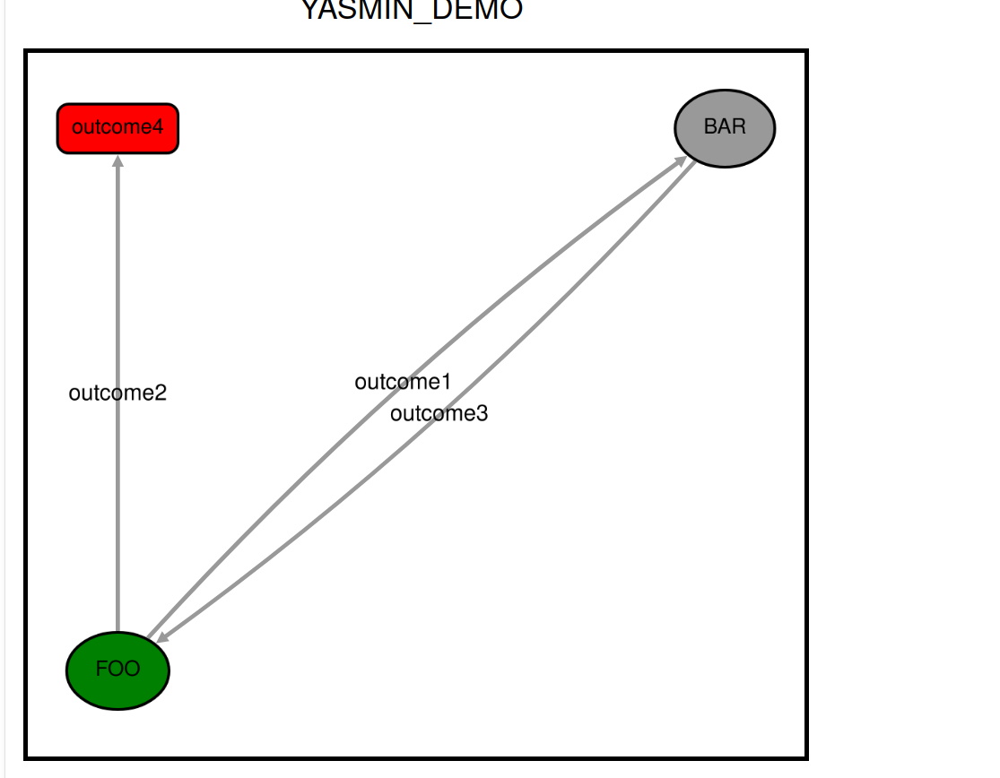
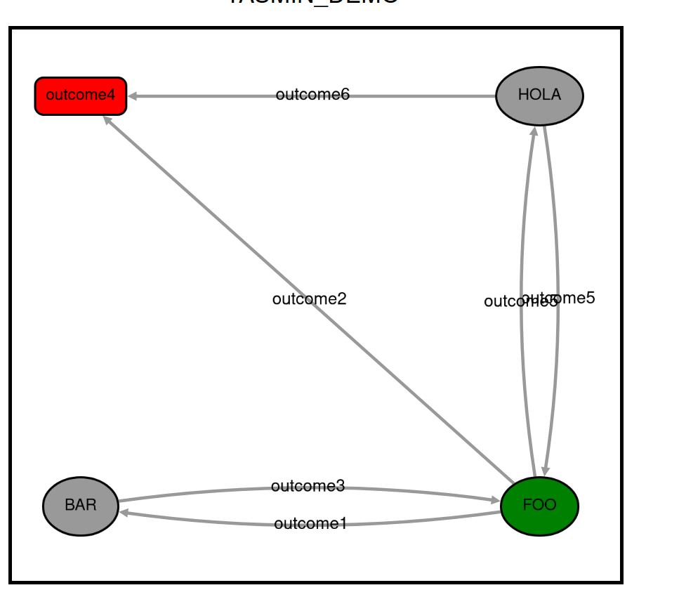

# Ejercicio 1. Revisa y transcribe el código del ejemplo Básico de YASMIN.

Probé el archivo de ejemplo de la biblioteca YASMIN (`yasmin_demo.py`).

## 1. Definición de los estados y sus posibles salidas

~~~python
class FooState(State):
    def __init__(self) -> None:
        super().__init__(["outcome1", "outcome2"])
~~~

Se define un estado llamado `FooState` que hereda de la clase base `State` de YASMIN. En su constructor (`__init__`), se declara con `super()` cuáles son las salidas (*outcomes*) posibles de este estado. Esto indica al sistema que, cuando `FOO` termine su ejecución, devolverá o bien `"outcome1"` o bien `"outcome2"`.

## 2. La lógica del estado y la memoria compartida (Blackboard)

~~~python
    def execute(self, blackboard: Blackboard) -> str:
        # ... (lógica del contador y pausas) ...
        blackboard["foo_str"] = f"Counter: {self.counter}"
        return "outcome1"
~~~

*El método `execute` contiene la tarea real que realiza el estado. Dado que los estados en YASMIN son independientes, utilizan el objeto `blackboard` (una pizarra o diccionario compartido) para pasarse información. Aquí, `FOO` guarda el valor de su contador en la pizarra bajo la clave `"foo_str"`, permitiendo que el estado `BAR` pueda leerlo posteriormente. Finalmente, la función retorna uno de los *outcomes* definidos previamente.

## 3. Creación de la Máquina de Estados

~~~python
    sm = StateMachine(outcomes=["outcome4"], handle_sigint=True)
~~~

Se instancia el orquestador principal: la máquina de estados (`sm`). Se define que el resultado global de la máquina, una vez termine por completo, será `"outcome4"`. El parámetro `handle_sigint=True` permite abortar la ejecución del programa de forma limpia y segura si el usuario interrumpe el proceso (por ejemplo, usando `Ctrl+C`).

## 4. Inserción de estados y mapeo de transiciones

~~~python
    sm.add_state(
        "FOO",
        FooState(),
        transitions={
            "outcome1": "BAR",
            "outcome2": "outcome4",
        },
    )
~~~

El método `add_state` introduce el estado dentro de la máquina y establece sus **transiciones** (el mapa de navegación). Indica que si `FOO` devuelve `"outcome1"`, el flujo de ejecución saltará al estado `"BAR"`. Si devuelve `"outcome2"`, saltará a `"outcome4"`, finalizando la máquina.

## 5. Conexión con la interfaz gráfica (YASMIN Viewer)

~~~python
    YasminViewerPub(sm, "YASMIN_DEMO")
~~~

Esta clase toma la máquina de estados (`sm`) y publica su información en la red de ROS 2 bajo el nombre `"YASMIN_DEMO"`. Es la instrucción clave que permite que el visor web retransmita e ilumine gráficamente los estados en tiempo real durante la ejecución.

## 6. Ejecución de la máquina

~~~python
    try:
        outcome = sm()
        yasmin.YASMIN_LOG_INFO(outcome)
~~~

*La llamada `sm()` inicia el funcionamiento de la máquina de estados, empezando por el primer estado añadido (`FOO`). El programa avanza automáticamente saltando entre estados según las transiciones definidas hasta alcanzar un estado final. El resultado definitivo se almacena en la variable `outcome` y se imprime mediante el *logger* de YASMIN.


Visualización del archivo: 




# Ejercicio 2. Extensión del ejemplo básico

En este ejercicio se ha modificado la Máquina de Estados Finitos (FSM) original para incorporar un nuevo estado llamado `HOLA`. 

## 2.1. Modificaciones realizadas en el código

Para lograr esta extensión, se han aplicado tres cambios fundamentales en el archivo `yasmin_demo.py`:

**1. Creación del nuevo estado (`HolaState`):**
Se ha programado una clase completamente nueva que define el comportamiento del estado adicional. Este estado tiene dos posibles salidas: volver al flujo principal (`outcome5`) o terminar la ejecución (`outcome6`).

~~~python
class HolaState(State):
    def __init__(self) -> None:
        super().__init__(["outcome5", "outcome6"])
        self.counter = 0

    def execute(self, blackboard: Blackboard) -> str:
        yasmin.YASMIN_LOG_INFO("Executing state HOLA")
        time.sleep(3)
        if self.counter < 3:
            self.counter += 1
            return "outcome5"
        else:
            return "outcome6"
~~~

**2. Modificación del estado distribuidor (`FooState`):**
Se ha alterado el estado `FOO` para que sea capaz de alcanzar el nuevo estado `HOLA`. Se añadió `"outcome5"` a su lista de salidas y se modificó su lógica interna para que decida dinámicamente hacia dónde ir según el valor de su contador.

~~~python
    def execute(self, blackboard: Blackboard) -> str:
        yasmin.YASMIN_LOG_INFO("Executing state FOO")
        time.sleep(3)
        self.counter += 1
        
        if self.counter == 1:
            return "outcome1"  # Salta a BAR
        elif self.counter == 2:
            return "outcome5"  # Salta a HOLA
        else:
            return "outcome2"  # Termina
~~~

**3. Mapeo de nuevas transiciones en el orquestador (`main`):**
Se ha registrado el nuevo estado en la FSM y se han conectado todas las flechas (transiciones) para evitar que el programa se quede en un callejón sin salida.

~~~python
    sm.add_state(
        "HOLA",
        HolaState(),
        transitions={
            "outcome5": "FOO",
            "outcome6": "outcome4", # Conexión segura al final de la máquina
        },
    )
~~~

Visualización del ejemplo modificado 


## 2.2. Efecto en el comportamiento del sistema

Antes de la modificación, el sistema tenía un comportamiento completamente **lineal y cerrado**: alternaba en un bucle simple entre `FOO` y `BAR` hasta que un contador interno alcanzaba su límite y finalizaba.

Al introducir el estado `HOLA` y modificar las transiciones, el comportamiento del sistema se ha transformado introduciendo **bifurcaciones condicionales**. El impacto principal es que el estado `FOO` asume ahora el rol de un **nodo distribuidor o selector**:

1. **Primera iteración:** La máquina arranca en `FOO` y este decide derivar el flujo de ejecución hacia `BAR`. `BAR` ejecuta su tarea y devuelve el control a `FOO`.
2. **Segunda iteración:** `FOO` detecta que es su segunda ejecución y cambia su decisión, derivando el flujo hacia la nueva rama del sistema (`HOLA`). `HOLA` se ejcuta y devuelve el control a `FOO`.
3. **Tercera iteración:** `FOO` detecta que ha cumplido su ciclo y decide tomar la salida final (`outcome4`), cerrando la máquina de estados de forma controlada.

Esta modificación demuestra la escalabilidad de YASMIN: permite añadir nuevos nodos y rutas lógicas complejas a un robot sin necesidad de reprogramar los estados periféricos ya existentes (por ejemplo, la clase `BarState` permaneció intacta y el sistema global cambió).


# Ejercicio 3. Concepto de Blackboard en YASMIN

## 3.1. Definición y propósito dentro de YASMIN

Un **Blackboard** es una estructura de datos compartida, similar a un diccionario o una tabla *hash*, que actúa como la **memoria de trabajo** (o memoria a corto plazo) del sistema.

Su propósito principal es resolver un problema de diseño fundamental: **el aislamiento de los estados**. En YASMIN, cada estado (como `FooState` o `BarState`) es una "caja negra" independiente que no sabe de la existencia de los demás estados. El Blackboard se pasa como parámetro en el método `execute` de cada estado, permitiendo que un estado escriba una variable (por ejemplo, `blackboard["contador"] = 5`) y que otro estado distinto, en el futuro, pueda leerla. Es literalmente como una pizarra en un aula: un profesor escribe algo, se va, y el siguiente profesor puede leerlo y borrarlo.

## 3.2. Ventajas en arquitecturas cognitivas

En el desarrollo de arquitecturas cognitivas (sistemas que intentan imitar el razonamiento, percepción y toma de decisiones de un ser vivo), el uso del patrón Blackboard aporta grandes beneficios:

* **Desacoplamiento total:** Como los estados no se pasan variables directamente de uno a otro, puedes reutilizar un estado en diferentes máquinas sin tener que reprogramarlo. 
* **Centralización de la percepción:** Permite que los nodos de percepción (visión, sensores) vuelquen la información del mundo exterior en un único lugar. Así, los nodos de toma de decisiones siempre tienen acceso a la "foto global" más actualizada del entorno del robot.
* **Escalabilidad:** Es muy fácil añadir nuevos comportamientos al robot. Un nuevo estado tiene acceso instantáneo a toda la información histórica que ya está fluyendo por la pizarra.

## 3.3. Desventajas y riesgos

* **Dependencias ocultas (Spaghetti Data):** Como cualquier estado puede leer y escribir en el Blackboard en cualquier momento, se vuelve muy difícil rastrear *quién* cambió una variable y *cuándo*. Si el robot falla porque la variable "distancia" tiene un valor imposible, encontrar qué estado cometió el error es dificil.
* **Falta de tipado estricto:** Al funcionar con claves de texto (strings), es fácil cometer errores tipográficos. Si un estado guarda la información en `blackboard["posicion_x"]` y el siguiente intenta leer `blackboard["posicionX"]`, el programa fallará en tiempo de ejecución.
* **Problemas de concurrencia:** En arquitecturas muy complejas donde varios procesos intentan escribir o leer la misma variable en la pizarra exactamente al mismo milisegundo, pueden generarse condiciones de carrera (*race conditions*) si el Blackboard no está protegido correctamente.


# 4. Integración de FSM con servicios en ROS 2
## 4.1 Prueba el ejemplo de Service Demo ejecutando los siguientes comandos:


'ros2 run yasmin_demos add_two_ints_server'


[INFO] [1772735778.409996460] [add_two_ints_server]: Incoming request
a: 10 b: 5

'ros2 run yasmin_demos service_client_demo .py'

[INFO] [1772735778.410191246] [yasmin_1811ca2b1cbdceef_node]: [state_machine.cpp:execute:348] State machine transitioning 'ADD_TWO_INTS' : 'outcome1' --> 'PRINTING_SUM'
[INFO] [1772735778.410220173] [yasmin_1811ca2b1cbdceef_node]: [service_client_demo.cpp:print_sum:60] Sum: 15


Explica el funcionamiento de la integraci´on de una m´aquina de estados finita (FSM) con un ROS 2
Action Client.


## 4.2. Explicación del funcionamiento de la integración (FSM y ROS 2 Service Client)

En una arquitectura de software robótico, un Servicio de ROS 2 representa una comunicación síncrona de tipo petición-respuesta (Request-Response) entre dos nodos. Por su parte, una Máquina de Estados Finita (FSM) gestiona la lógica de toma de decisiones del robot. 

La integración de ambos conceptos en frameworks como YASMIN se realiza encapsulando el cliente del servicio dentro de un estado específico (un `ServiceState`). El flujo de funcionamiento es el siguiente:

1. **Preparación (Request):** Antes de llamar al servicio, un estado previo prepara los datos necesarios para la petición y los almacena en la memoria global de la FSM (el Blackboard).
2. **Llamada Asíncrona:** El estado cliente (`ServiceState`) lee los parámetros del Blackboard y envía la petición al servidor de ROS 2. Para no bloquear el hilo de ejecución del nodo de la FSM, esta espera se gestiona de forma asíncrona.
3. **Recepción (Response):** Una vez el servidor procesa la petición y devuelve el resultado, el estado captura esta respuesta y la guarda de nuevo en el Blackboard para que el resto del sistema pueda utilizarla.
4. **Transición (Outcome):** Dependiendo del resultado de la comunicación (por ejemplo, si la llamada fue exitosa o si el servidor falló), el estado devuelve un resultado o *outcome* (como `SUCCEED` o `ABORT`). Este *outcome* es el que dispara la transición hacia el siguiente estado correspondiente en la FSM.

---

## 4.3  Modificaciones realizadas en el código (Múltiples solicitudes y almacenamiento)

Para transformar la ejecución lineal del ejemplo base en un bucle que realiza múltiples peticiones y almacena los resultados, se han realizado tres modificaciones principales utilizando el Blackboard como memoria persistente:

* **Modificación 1: Inicialización de variables en el Blackboard (`set_ints`)**
  Se ha modificado la función (estado) que prepara los datos para que, en su primera ejecución, inicialice un `contador` a 0 y una lista vacía `respuestas` en el Blackboard. Para evitar que se sobrescriban en las siguientes iteraciones, se ha utilizado un bloque `try-except` que comprueba si la variable ya existe. Además, se ha dinamizado la petición para que cambie en cada iteración (ej. `a = 10 + contador`).

* **Modificación 2: Almacenamiento y lógica de control (`print_sum`)**
  En el estado que procesa la respuesta del servidor, se ha añadido la lógica para extraer el resultado de la suma y hacer un *append* a la lista `respuestas` almacenada en el Blackboard. Tras esto, se incrementa el `contador`. Finalmente, se ha añadido una estructura condicional `if/else`: si el contador es menor que el límite deseado (ej. 3 iteraciones), la función devuelve un nuevo *outcome* personalizado llamado `"repetir"`. Si alcanza el límite, devuelve `SUCCEED`.

* **Modificación 3: Recableado de transiciones (Bucle en la FSM)**
  En la definición de la máquina de estados dentro de la función `main`, se ha registrado el nuevo *outcome* `"repetir"` en el estado `PRINTING_SUM`. Se ha añadido una nueva transición que conecta este *outcome* de vuelta al estado inicial `SETTING_INTS`. De esta forma, la FSM cicla automáticamente entre la preparación de datos, la llamada al servicio y el almacenamiento, hasta que se cumple la condición de parada.

En el servidor: 

[INFO] [1772738234.859036222] [add_two_ints_server]: Incoming request
a: 10 b: 5
[INFO] [1772738234.862078624] [add_two_ints_server]: Incoming request
a: 11 b: 5
[INFO] [1772738234.864840229] [add_two_ints_server]: Incoming request
a: 12 b: 5

el archivo: 

[INFO] [1772738234.860662230] [yasmin_2a4b2d7b395d4584_node]: [state_machine.cpp:execute:349] State machine transitioning 'ADD_TWO_INTS' : 'outcome1' --> 'PRINTING_SUM'
Suma actual: 15. Lista total: [15]
[INFO] [1772738234.860979835] [yasmin_2a4b2d7b395d4584_node]: [state_machine.cpp:execute:349] State machine transitioning 'PRINTING_SUM' : 'repetir' --> 'SETTING_INTS'
[INFO] [1772738234.861222444] [yasmin_2a4b2d7b395d4584_node]: [state_machine.cpp:execute:349] State machine transitioning 'SETTING_INTS' : 'succeeded' --> 'ADD_TWO_INTS'
[INFO] [1772738234.861581136] [yasmin_2a4b2d7b395d4584_node]: [service_state.py:execute:138] Waiting for service '/add_two_ints'
[INFO] [1772738234.861872665] [yasmin_2a4b2d7b395d4584_node]: [service_state.py:execute:153] Sending request to service '/add_two_ints'
[INFO] [1772738234.863373857] [yasmin_2a4b2d7b395d4584_node]: [state_machine.cpp:execute:349] State machine transitioning 'ADD_TWO_INTS' : 'outcome1' --> 'PRINTING_SUM'
Suma actual: 16. Lista total: [15, 16]
[INFO] [1772738234.863708459] [yasmin_2a4b2d7b395d4584_node]: [state_machine.cpp:execute:349] State machine transitioning 'PRINTING_SUM' : 'repetir' --> 'SETTING_INTS'
[INFO] [1772738234.863956841] [yasmin_2a4b2d7b395d4584_node]: [state_machine.cpp:execute:349] State machine transitioning 'SETTING_INTS' : 'succeeded' --> 'ADD_TWO_INTS'
[INFO] [1772738234.864264489] [yasmin_2a4b2d7b395d4584_node]: [service_state.py:execute:138] Waiting for service '/add_two_ints'
[INFO] [1772738234.864601941] [yasmin_2a4b2d7b395d4584_node]: [service_state.py:execute:153] Sending request to service '/add_two_ints'
[INFO] [1772738234.866565577] [yasmin_2a4b2d7b395d4584_node]: [state_machine.cpp:execute:349] State machine transitioning 'ADD_TWO_INTS' : 'outcome1' --> 'PRINTING_SUM'
Suma actual: 17. Lista total: [15, 16, 17]

---

# Ejercicio 5. Integración de FSM con acciones en ROS 2

## 5.1. Prueba del ejemplo de Action Demo

Se ejecutaron los siguientes comandos:

Terminal 1 (Servidor):
```bash
ros2 run yasmin_demos fibonacci_action_server
```

Terminal 2 (Cliente):
```bash
ros2 run yasmin_demos action_client_demo
```

**Output del servidor:**

```
[INFO] [1774969039.863933476] [fibonacci_action_server]: Fibonacci Server started
[INFO] [1774969049.202462176] [fibonacci_action_server]: Received goal request with order 10
[INFO] [1774969049.202775875] [fibonacci_action_server]: Executing goal
[INFO] [1774969049.202898092] [fibonacci_action_server]: Publish feedback
[INFO] [1774969050.203232501] [fibonacci_action_server]: Publish feedback
[INFO] [1774969051.203117415] [fibonacci_action_server]: Publish feedback
[INFO] [1774969052.203204489] [fibonacci_action_server]: Publish feedback
[INFO] [1774969053.203249902] [fibonacci_action_server]: Publish feedback
[INFO] [1774969054.203210836] [fibonacci_action_server]: Publish feedback
[INFO] [1774969055.203239254] [fibonacci_action_server]: Publish feedback
[INFO] [1774969056.203228553] [fibonacci_action_server]: Publish feedback
[INFO] [1774969057.203232637] [fibonacci_action_server]: Publish feedback
[INFO] [1774969058.203452491] [fibonacci_action_server]: Goal succeeded
```

**Output del cliente:**

```
[INFO] [1774969049.198111999] [yasmin_670d375c7e62c36f_node]: [action_client_demo.cpp:main:152] yasmin_action_client_demo
[INFO] [1774969049.198348540] [yasmin_670d375c7e62c36f_node]: [ros_clients_cache.hpp:get_or_create_action_client:91] Creating new action client for '/fibonacci'
[INFO] [1774969049.202056822] [yasmin_670d375c7e62c36f_node]: [state_machine.cpp:execute:313] Executing state machine with initial state 'CALLING_FIBONACCI'
[INFO] [1774969049.202144858] [yasmin_670d375c7e62c36f_node]: [action_state.hpp:execute:322] Waiting for action '/fibonacci'
[INFO] [1774969049.202201485] [yasmin_670d375c7e62c36f_node]: [action_state.hpp:execute:364] Sending goal to action '/fibonacci'
[INFO] [1774969049.203044215] [yasmin_670d375c7e62c36f_node]: [action_client_demo.cpp:print_feedback:141] Received feedback: [0, 1, 1]
[INFO] [1774969050.203814028] [yasmin_670d375c7e62c36f_node]: [action_client_demo.cpp:print_feedback:141] Received feedback: [0, 1, 1, 2]
[INFO] [1774969051.203658361] [yasmin_670d375c7e62c36f_node]: [action_client_demo.cpp:print_feedback:141] Received feedback: [0, 1, 1, 2, 3]
[INFO] [1774969052.203610181] [yasmin_670d375c7e62c36f_node]: [action_client_demo.cpp:print_feedback:141] Received feedback: [0, 1, 1, 2, 3, 5]
[INFO] [1774969053.203994390] [yasmin_670d375c7e62c36f_node]: [action_client_demo.cpp:print_feedback:141] Received feedback: [0, 1, 1, 2, 3, 5, 8]
[INFO] [1774969054.203787566] [yasmin_670d375c7e62c36f_node]: [action_client_demo.cpp:print_feedback:141] Received feedback: [0, 1, 1, 2, 3, 5, 8, 13]
[INFO] [1774969055.203817010] [yasmin_670d375c7e62c36f_node]: [action_client_demo.cpp:print_feedback:141] Received feedback: [0, 1, 1, 2, 3, 5, 8, 13, 21]
[INFO] [1774969056.203647943] [yasmin_670d375c7e62c36f_node]: [action_client_demo.cpp:print_feedback:141] Received feedback: [0, 1, 1, 2, 3, 5, 8, 13, 21, 34]
[INFO] [1774969057.203810282] [yasmin_670d375c7e62c36f_node]: [action_client_demo.cpp:print_feedback:141] Received feedback: [0, 1, 1, 2, 3, 5, 8, 13, 21, 34, 55]
[INFO] [1774969058.204497270] [yasmin_670d375c7e62c36f_node]: [state_machine.cpp:execute:349] State machine transitioning 'CALLING_FIBONACCI' : 'succeeded' --> 'PRINTING_RESULT'
[INFO] [1774969058.204796107] [yasmin_670d375c7e62c36f_node]: [action_client_demo.cpp:print_result:59] Result: [0, 1, 1, 2, 3, 5, 8, 13, 21, 34, 55]
[INFO] [1774969058.204885947] [yasmin_670d375c7e62c36f_node]: [state_machine.cpp:execute:349] State machine transitioning 'PRINTING_RESULT' : 'succeeded' --> 'outcome4'
[INFO] [1774969058.204948267] [yasmin_670d375c7e62c36f_node]: [state_machine.cpp:execute:357] State machine ends with outcome 'outcome4'
[INFO] [1774969058.205011908] [yasmin_670d375c7e62c36f_node]: [action_client_demo.cpp:main:184] outcome4
```

## 5.2. Explicación del funcionamiento de la integración (FSM y ROS 2 Action Client)

Una **Acción en ROS 2** es un protocolo de comunicación asíncrono entre nodos que permite:
- Enviar un objetivo (*goal*) al servidor
- Recibir retroalimentación (*feedback*) mientras se ejecuta
- Obtener un resultado final (*result*) cuando termina

Esta es la diferencia principal con los servicios: mientras que un servicio es síncrono (petición-respuesta), las acciones son asíncronas y permiten monitorear el progreso.

### Flujo de funcionamiento:

1. **Creación del ActionState (`FibonacciState`):** Un estado especializado que encapsula la comunicación con el servidor de acciones. Hereda de `ActionState` y define:
   - El tipo de acción (`Fibonacci`)
   - El nombre de la acción (`/fibonacci`)
   - Un método para crear el objetivo (`create_goal_handler`)
   - Un método para procesar la respuesta (`response_handler`)
   - Un método para procesar el feedback (`print_feedback`)

2. **Preparación del Objetivo:** Antes de enviar la acción, el método `create_goal_handler` lee un valor del Blackboard (por ejemplo, `n = 10`) y lo asigna como la orden de la secuencia de Fibonacci.

3. **Envío de la Acción:** El cliente de acciones envía el objetivo al servidor, que comienza a calcular la secuencia de Fibonacci de forma asíncrona.

4. **Recepción de Feedback:** Mientras el servidor está calculando, envía feedback periódicamente (cada segundo en este caso) con la secuencia generada hasta el momento. El método `print_feedback` se invoca en cada feedback recibido.

5. **Recepción del Resultado:** Una vez el servidor completa el cálculo, envía el resultado final (la secuencia completa) y el método `response_handler` lo captura y lo almacena en el Blackboard.

6. **Transición de Estados:** Dependiendo del resultado (SUCCEED, ABORT, o CANCEL), la FSM transiciona al siguiente estado.

### Estados de la FSM:
- **CALLING_FIBONACCI:** Estado que ejecuta la acción de Fibonacci
- **PRINTING_RESULT:** Estado que imprime el resultado final

---

## 5.3. Modificación del ejemplo: Supervisión de progreso y límite de valor

Se ha modificado el código para que el cliente **supervise el progreso de la acción y detenga la ejecución si la secuencia supera un valor determinado** (en este caso, 20).

### Modificación principal en el método `print_feedback`:

~~~python
def print_feedback(self, blackboard: Blackboard, feedback: Fibonacci.Feedback) -> bool:
    """
    Imprime el feedback y decide si cancelar la acción.
    """
    # Convertimos la secuencia a una lista normal de Python
    secuencia_actual = list(feedback.sequence)
    yasmin.YASMIN_LOG_INFO(f"Received feedback: {secuencia_actual}")
    
    # Cogemos el último número de la lista (el más grande hasta ahora)
    ultimo_numero = secuencia_actual[-1]
    
    # elegimos el limite (20)
    limite = 20
    
    if ultimo_numero > limite:
        yasmin.YASMIN_LOG_WARN(f"¡Límite superado! ({ultimo_numero} > {limite}). Cancelando acción...")
        return True  # YASMIN abortará la acción.
        
    return False # Si no supera el límite, devolvemos False para que siga la accion.
~~~

### Funcionamiento:

- En cada iteración del feedback, se **extrae el último número de la secuencia** generada hasta ese momento (el más grande)
- Se compara con el límite definido (20)
- Si se supera, el método devuelve `True`, lo que **cancela la acción** en el servidor
- Si no se supera, devuelve `False` para que continúe la ejecución

### Diferencia con el flujo sin modificar:

**Sin la modificación:** El cliente recibe todos los 10 números de la secuencia (0, 1, 1, 2, 3, 5, 8, 13, 21, 34, 55), permitiendo que el servidor termine completamente.

**Con la modificación:** El cliente **cancela la acción cuando la secuencia alcanza 34**, porque después de eso vendría el 55, que supera el límite de 20. Esto demuestra cómo YASMIN permite que el cliente tenga control sobre acciones que se ejecutan en otro nodo, pudiendo interrumpirlas en tiempo real basándose en el feedback recibido.

### Ventajas de este enfoque:

1. **Control reactivo:** El cliente puede reaccionar en tiempo real a cambios en el estado de la acción
2. **Ahorro de recursos:** Al cancelar tempranamente, se evita que el servidor continue procesando
3. **Flexibilidad:** Se pueden implementar lógicas complejas basadas en el progreso (p.ej., cambiar parámetros, cambiar de estrategia, etc.)
4. **Robustez:** Permite manejar casos donde el servidor se queda atrapado o genera valores indeseados

---

# Ejercicio 6. Integración de FSM en ROSER (Práctica Final)

Para la práctica final de ROSER (Robot Navegando entre waypoints), se ha refactorizado la lógica del script principal para gestionar las decisiones con una **Máquina de Estados Finita (YASMIN)**, aplicando además el concepto de estados especializados: los `ActionState` y `ServiceState` descritos en ejercicios anteriores.

## 6.1. Modificaciones en el Código

En el archivo `navegador_fsm.py` se utilizan componentes asíncronos propios de YASMIN para evitar bucles o esperas de bloqueo (*busy waits*), apoyándose en la infraestructura de ROS 2.

* **El estado `SelectControllerState`**:
  Hereda de `ServiceState`. En lugar de llamar al servicio sincronamente en su iteración de un *State* regular, el estado formula su petición de Request dentro del método `create_request_handler`, apuntando al servicio `/controller_server/set_parameters`.
  Al completarse, entra directamente al `response_handler` y propaga el `SUCCEED`.

* **El estado `NavigateState`**:
  Hereda directamente de `ActionState`, que es ideal para procesos largos y secuenciales como llegar a un *waypoint*, apuntando a la acción `/navigate_to_pose`. Se le provee la pose generada y actúa asíncronamente; una vez Nav2 indica éxito, el `response_handler` anuncia que el robot llegó correctamente liberando el estado como exitoso (`SUCCEED`), o aborta indicando la transición pertinente para ir al siguiente punto o parar.

Este programa puede ejecutarse mediante los mismos entornos de simulación en Gazebo que la práctica original, aportando además toda la trazabilidad que brinda la interfaz web de `yasmin_viewer` al conectarse a `ROSER_FSM_NAV`.
