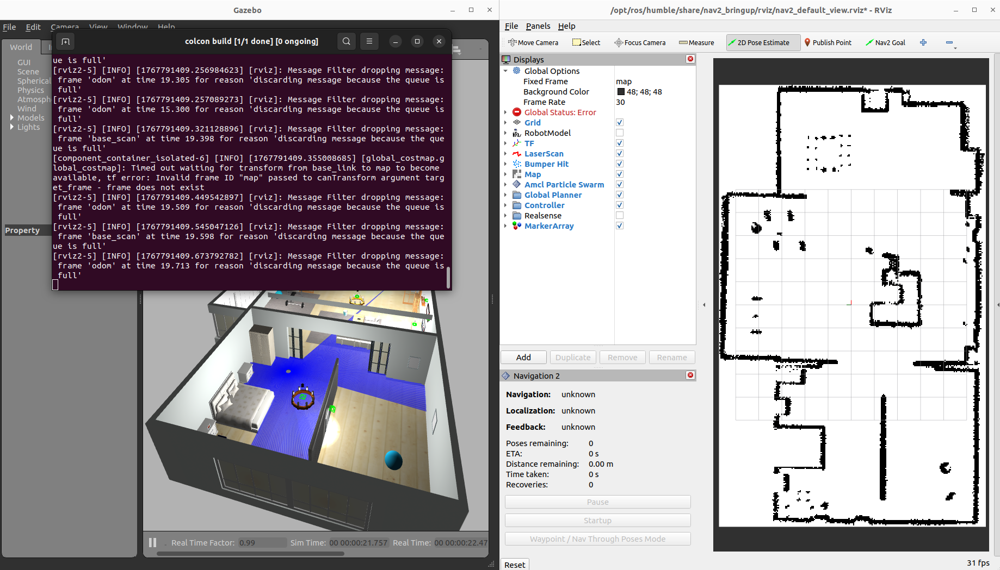
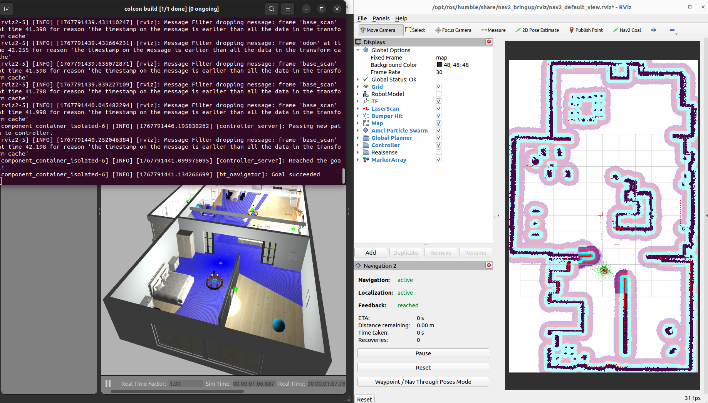
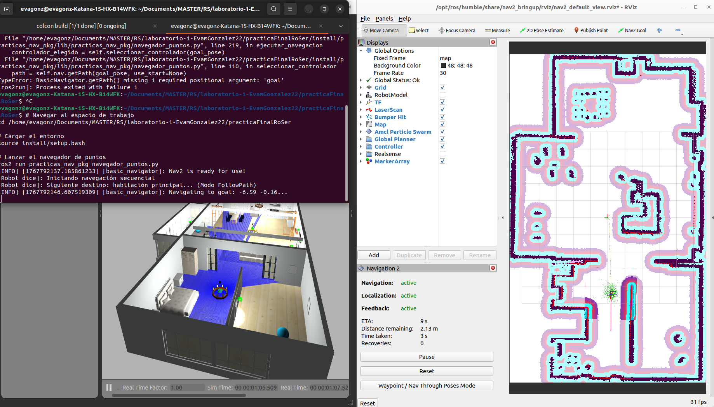
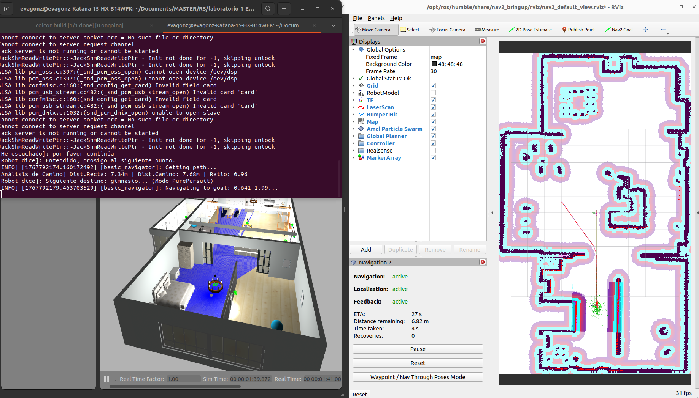

# Práctica Final: Navegación Avanzada con Nav2 y Voz (ROS 2)

**Autor:** Eva González  
**Máster:** Robótica de Servicios

---

## 1. CONFIGURACIÓN INICIAL DEL ENTORNO

El objetivo de esta fase es establecer la base de simulación (robot TurtleBot3 Burger) y cargar el stack de navegación Nav2 con el mapa de la AWS House.

### 1.1. Creación y Estructura del Paquete

Se creó el paquete ROS 2 (`ament_python`) llamado `PracticaFinal` en el workspace.

**Creación del paquete:**
```bash
ros2 pkg create --build-type ament_python PracticaFinal
```

**Ajuste de la estructura de directorios:**  
Se eliminó la carpeta duplicada generada por `ament_python` para simplificar y se crearon las carpetas esenciales (`config`, `launch`, `src`).

```bash
cd PracticaFinal
rm -rf PracticaFinal/
mkdir config launch src
```

### 1.2. Dependencias de Audio y Voz

El sistema de interacción por voz requiere librerías externas a ROS 2 para gestionar el micrófono y la reproducción de audio. Es necesario instalarlas manualmente en el entorno:

**Herramientas del Sistema:**
Se requiere `mpg123` para la reproducción ligera de archivos MP3 generados por el TTS y librerías de desarrollo de audio para el micrófono.

`sudo apt-get update`
`sudo apt-get install mpg123 portaudio19-dev flac`

**Librerías de Python:**
Se deben instalar los paquetes para síntesis (`gTTS`), reconocimiento (`SpeechRecognition`) y gestión de entrada de audio (`PyAudio`).

`pip3 install gTTS SpeechRecognition pyaudio`

### 1.3. Archivos de Configuración (`config/`)

Se descargó y configuró el mapa, y se definió la ruta inicial para las pruebas.

**Archivos del Mapa (AWS House):**
* **Fuente del Mapa:** El mapa `aws_house` (`aws_house.yaml` y `aws_house.pgm`) fue tomado del repositorio del **Workshop de Navegación Avanzada de ROSCon 2025** ([EasyNavigation/roscon2025_workshop](https://github.com/EasyNavigation/roscon2025_workshop)). También se descargó la carpeta `models`, para que carguen las texturas correctamente.
* **Ubicación:** `PracticaFinal/config/`

**Waypoints Iniciales:**  
Se definieron 5 puntos de ruta para validar el funcionamiento del planificador en un recorrido básico.
* **Archivo:** `PracticaFinal/config/waypoints.yaml`

### 1.4. Archivos de Lanzamiento (`launch/`)

Se creó el script de lanzamiento que orquesta el inicio de Gazebo (con el robot Burger) y el stack completo de Nav2, cargando el mapa `aws_house.yaml`.

* **Archivo:** `PracticaFinal/launch/casaModerna.launch.py`

Este script configura la variable de entorno `TURTLEBOT3_MODEL` a `burger` e invoca `turtlebot3_world.launch.py` junto con `nav2_bringup/bringup_launch.py`, pasándole la ruta del mapa como argumento.

### 1.5. Instalación y Compilación

Para que ROS 2 reconozca los nuevos archivos de configuración (`.yaml`, `.pgm`, `.launch.py`), se realizó la instalación mediante `setup.py` y la compilación.

**Ajuste de `setup.py`:**  
Se modificó la sección `data_files` para incluir los contenidos de las carpetas `launch/` y `config/`.

---

## 2. GUÍA DE EJECUCIÓN

Esta sección describe los pasos necesarios para iniciar el sistema completo de navegación con waypoints.

### 2.1. Inicio desde Cero

Si hay que reiniciar todo el sistema desde cero:

```bash
# Cerrar todos los procesos previos
killall -9 gzserver gzclient rviz2

# Navegar al workspace
cd /home/evagonz/Documents/MASTER/RS/laboratorio-1-EvamGonzalez22/practicaFinalRoSer

# Compilar el paquete
colcon build --symlink-install

# Cargar el entorno
source install/setup.bash

# Lanzar la simulación completa
ros2 launch practicas_nav_pkg casaModerna.launch.py
```

### 2.3. Ejecución de la Misión de Navegación

Para ejecutar correctamente la navegación con waypoints, sigue estos pasos en orden:

#### Terminal 1: Iniciar el Entorno (Gazebo + RViz + Nav2)

Si solo has cerrado y abierto VS Code y no necesitas recompilar:

```bash
# Navegar al workspace
cd /home/evagonz/Documents/MASTER/RS/laboratorio-1-EvamGonzalez22/practicaFinalRoSer

# Cargar el entorno
source install/setup.bash

# Lanzar la simulación completa
ros2 launch practicas_nav_pkg casaModerna.launch.py
```



#### Paso Previo: Localización Inicial (Manual)

**IMPORTANTE:** Antes de ejecutar el script de navegación, el robot debe estar localizado en el mapa.

1. Ve a la ventana de **RViz**.
2. Haz clic en el botón **"2D Pose Estimate"** de la barra superior.
3. Haz clic y arrastra en el mapa sobre la posición donde aparece el robot en **Gazebo**.
4. Verifica que los errores de la terminal desaparezcan y el robot esté bien posicionado.



#### Terminal 2: Ejecutar el Script de Misión

Una vez que el sistema está localizado, abre una **segunda terminal** para enviar los objetivos:

```bash
# Navegar al espacio de trabajo
cd /home/evagonz/Documents/MASTER/RS/laboratorio-1-EvamGonzalez22/practicaFinalRoSer

# Cargar el entorno
source install/setup.bash

# Lanzar el navegador de puntos
ros2 run practicas_nav_pkg navegador_puntos.py
```





#### Descripción del Proceso

El script realizará las siguientes acciones automáticamente:

* **Lectura de Waypoints**: Carga las coordenadas desde `config/waypoints.yaml`.
* **Espera Activa**: El script esperará hasta que Nav2 esté completamente activo antes de empezar.
* **Modo Secuencial**: El robot visitará los 5 puntos (Entrada, Salón, Cocina, Habitación 1 y Salita) en orden.
* **Modo Aleatorio**: El robot visitará los puntos en un orden aleatorio. Justo después del secuencial 

---

## 3. IMPLEMENTACIÓN DE MÚLTIPLES PLANIFICADORES LOCALES EN NAV2

Después se procedió a la implementación del requisito opcional: "Uso de Múltiples Planificadores Locales". El objetivo es dotar al robot de la capacidad de alternar dinámicamente entre el controlador estándar (DWB FollowPath) y un controlador de persecución pura (Regulated Pure Pursuit) durante la ejecución de la misión.

### 3.1. Instalación de Paquetes

Para utilizar el algoritmo Regulated Pure Pursuit (RPP), fue necesario instalar el paquete correspondiente de Nav2 en la distribución Humble.

```bash
sudo apt update
sudo apt install ros-humble-nav2-regulated-pure-pursuit-controller
```

### 3.2. Configuración de Parámetros (YAML)

Se modificó el archivo de configuración `nav2_params.yaml` en la sección `controller_server`. Los cambios realizados permiten cargar dos plugins de control simultáneamente.

* Se actualizó la lista `controller_plugins` para incluir ambos planificadores.
  
```yaml
controller_server:
    ros__parameters:

    # DEFINICIÓN DE PLUGINS
    controller_plugins: ["FollowPath", "PurePursuit"]
```

* Se añadió el bloque de configuración específico para `PurePursuit`. Y se modificó la de Follow Path.
Para darle al robot de diferentes comportamientos de navegación, se ha modificado el archivo de configuración `nav2_params.yaml` en la sección `controller_server`. Se han habilitado dos plugins de control simultáneos con configuraciones opuestas:

1.  **Modo Precisión (`FollowPath`):** Utiliza el algoritmo **DWB**. Se ha configurado con velocidad reducida y parámetros estrictos de seguimiento de ruta para maniobras en espacios reducidos.
2.  **Modo Velocidad (`PurePursuit`):** Utiliza el algoritmo **Regulated Pure Pursuit**. Se ha configurado con mayor velocidad y una distancia de visión (*lookahead*) amplia para suavizar las curvas en tramos abiertos.

```yaml
controller_server:
  ros__parameters:
    # Habilitación de ambos plugins en el servidor
    controller_plugins: ["FollowPath", "PurePursuit"]

    # Perfil 1: Lento y preciso (DWB)
    FollowPath:
      plugin: "dwb_core::DWBLocalPlanner"
      max_vel_x: 0.12        # Velocidad limitada
      PathAlign.scale: 64.0  # Alta penalización por desviarse de la línea

    # Perfil 2: Rápido y fluido (RPP)
    PurePursuit:
      plugin: "nav2_regulated_pure_pursuit_controller::RegulatedPurePursuitController"
      desired_linear_vel: 0.40 # Alta velocidad objetivo
      lookahead_dist: 1.5      # Corta las curvas con antelación

```

### 3.3. Implementación en Python (navegador_puntos.py)

Se modificó el script principal de navegación para cumplir con el requisito de "cambiar dinámicamente el planificador local utilizando servicios".

#### A. Cliente de Servicio

Se implementó un cliente para el servicio `/controller_server/set_parameters` dentro de la clase `WaypointNavigator`. Esto permite solicitar cambios en la configuración del controlador en tiempo de ejecución.

```python
# En __init__
self.service_node = rclpy.create_node('change_controller_client')
self.client_param = self.service_node.create_client(SetParameters, '/controller_server/set_parameters')
```

#### B. Lógica de Selección de Controlador

Se definió un criterio lógico dinámico para decidir qué algoritmo utilizar en función de la **geometría del camino** planificado, en lugar de usar asignaciones fijas.

**Algoritmo de Decisión:**
El script solicita al planificador global una simulación de la ruta (`getPath`) antes de mover el robot. Con los datos obtenidos, calcula un **Índice de Rectitud (Ratio)** comparando la distancia en línea recta (vuelo de pájaro) con la longitud real que deberá recorrer el robot.

$$\text{Ratio} = \frac{\text{Distancia Línea Recta}}{\text{Longitud Real del Camino}}$$

* **Ratio > 0.75 (Camino Recto):** Se selecciona **PurePursuit** (Modo Rápido/Suave) para tramos como pasillos.
* **Ratio < 0.75 (Camino Sinuoso):** Se selecciona **FollowPath** (Modo Preciso) para maniobras complejas.


#### C. Ejecución del Cambio

Antes de enviar cada objetivo (`goToPose`), el script ejecuta una lógica secuencial para determinar y aplicar el controlador adecuado.

Se ha implementado una gestión especial para el primer punto de la ruta, dado que el análisis geométrico requiere un punto de origen y destino definidos:

1.  **Caso Inicial (Índice 0):** Al no existir un waypoint previo que sirva como punto de partida para la simulación del camino, se asigna por seguridad el modo **FollowPath**.
2.  **Caso Estándar (Índice > 0):** Se define el punto de inicio (`start_pose`) como el waypoint anterior y el destino (`goal_pose`) como el actual. Se invoca la función de análisis geométrico.
3.  **Aplicación:** Se llama al servicio de cambio de parámetros y se informa por voz antes de mover el robot.

---

## 4. RESOLUCIÓN DE PROBLEMAS TÉCNICOS

Durante el desarrollo del sistema de navegación autónoma se encontraron diversos retos técnicos relacionados con la integración de Gazebo, RViz y Nav2. A continuación se detallan los problemas identificados y las soluciones implementadas.

### 4.1. Sincronización entre Gazebo y RViz

**Problema identificado:**  
Al inicio, el simulador Gazebo cargaba el entorno por defecto (`empty_world`), mientras que RViz mostraba el mapa de la casa personalizada. Esta falta de coincidencia hacía que el robot fuera incapaz de localizarse, ya que sus sensores láser no detectaban las paredes que el mapa de RViz indicaba.

**Proceso de investigación:**  
Gran parte del tiempo se dedicó a investigar en foros y documentación oficial cómo vincular correctamente ambos entornos. La dificultad principal consistió en identificar qué archivo `.world` específico era compatible con el modelo de la casa y localizar sus mapas correspondientes (`.yaml` y `.pgm`). Cualquier mínima discrepancia en las dimensiones del mundo hacía que la localización fallara.

**Solución aplicada:**  
Tras una búsqueda exhaustiva, se editó el archivo de lanzamiento `navegacion_completa.launch.py` para forzar la carga del mundo exacto. Se verificó que el servidor de mapas (`map_server`) apuntara al archivo `.yaml` generado durante la fase de SLAM, logrando finalmente una coincidencia entre la física del simulador y la representación lógica del mapa.

### 4.2. Activación de Plugins de Sensores

**Problema identificado:**  
El robot aparecía en la simulación, pero no publicaba datos en el tópico `/scan`. Sin lecturas del Lidar, el sistema de navegación no podía generar los mapas de costes (Costmaps) ni detectar obstáculos en tiempo real.

**Solución aplicada:**  
El problema residía en la ausencia de las variables de entorno necesarias para que los plugins de ROS 2 en Gazebo identificaran el modelo de hardware. Se resolvió exportando el modelo antes del lanzamiento con el comando:

```bash
export TURTLEBOT3_MODEL=burger
```

Esto permitió que el `robot_state_publisher` cargara correctamente el archivo URDF y activara el sensor láser. Posteriormente, se integró esta configuración directamente en la lógica del script de lanzamiento para evitar tener que ejecutar el comando manualmente.

### 4.3. Activación de Plugins de Sensores

**Problema identificado:**  
El robot aparecía en la simulación, pero no publicaba datos en el tópico `/scan`. Sin lecturas del Lidar, el sistema de navegación no podía generar los mapas de costes (Costmaps) ni detectar obstáculos en tiempo real.

**Solución aplicada:**  
El problema residía en la ausencia de las variables de entorno necesarias para que los plugins de ROS 2 en Gazebo identificaran el modelo de hardware. Se resolvió exportando el modelo antes del lanzamiento con el comando:

```bash
export TURTLEBOT3_MODEL=burger
```

### 4.4. Errores de Transformada (TF) y Localización

**Problema identificado:**  
RViz reportaba errores críticos en los *Global Costmap*, indicando que no existía una transformada entre los marcos de referencia `map` y `odom`. El robot aparecía desubicado en un origen desconocido.

**Solución aplicada:**  
Se utilizó la herramienta **"2D Pose Estimate"** en RViz para indicar al algoritmo **AMCL** (Adaptive Monte Carlo Localization) la posición aproximada del robot. Al mover el robot levemente mediante teleoperación, el filtro de partículas de AMCL convergió, estableciendo la transformada necesaria y activando correctamente la planificación de rutas.

### 4.5. Precisión de Waypoints y Navegación en Espacios Estrechos

**Problema identificado:**  
Durante las primeras pruebas de navegación, el robot intentaba atravesar paredes o se bloqueaba en bucles de recuperación al intentar entrar en pasillos estrechos como la "Habitación 1".

**Solución aplicada:**  
Se realizaron dos ajustes principales:

1. **Coordenadas de Waypoints**: Se ajustaron manualmente las coordenadas en el archivo `waypoints.yaml` basándose en lecturas reales de RViz para asegurar que los puntos de destino fueran navegables.

2. **Radio de Inflado**: Se revisó el parámetro `inflation_radius` en la configuración de Nav2 para asegurar que el "colchón de seguridad" del robot le permitiera cruzar puertas estrechas sin detectar colisiones falsas.

### 4.6. Sincronización de Audio y Reconocimiento de Voz

**Problema identificado:**  
El robot comenzaba a escuchar demasiado pronto tras reproducir el mensaje de confirmación ("Dime si continúo"), captando su propia voz por el micrófono y detectando falsamente un "sí". Esto provocaba que el robot continuara la misión automáticamente sin esperar la respuesta del usuario.

**Proceso de investigación:**  
Se identificó que el problema estaba en la sincronización temporal entre la reproducción de audio y la activación del micrófono. El sistema de reconocimiento de voz comenzaba a capturar mientras el altavoz aún reproducía el mensaje.

**Solución aplicada:**  
Se reestructuró la función de escucha para separar claramente la reproducción del mensaje y el inicio de la captura de audio:

1. Se movió la frase de la pregunta fuera de la función de escucha
2. Se añadió una pequeña espera (`sleep`) antes de activar el reconocimiento
3. Se reconstruyó el paquete con `colcon build` para asegurarse de que los cambios en el script Python se reflejaran en la versión ejecutada

Esta solución evitó que el robot se "escuchara a sí mismo" y permitió que solo reaccionara a la respuesta del usuario.

### 4.7. Limitación de la API `BasicNavigator` en ROS 2 Humble

**Problema identificado:** Al intentar cambiar el planificador de la forma simplificada, pasando el argumento `controller_id` directamente a la función `goToPose`, el programa fallaba con un `TypeError`. Se determinó que la versión de la librería `nav2_simple_commander` instalada en el entorno actual no soporta este parámetro directo.

**Solución aplicada:** Se optó por implementar la solución solicitada explícitamente en el guion de prácticas: un **cliente de servicio ROS 2** (`/controller_server/set_parameters`). Se integró este cliente dentro del script Python para modificar la configuración del controlador activo justo antes de enviar la orden de movimiento. Integgrado en la función 'cambiar_controlador_servicio'

### 4.8. Argumentos Insuficientes en la Lógica Inteligente

**Problema identificado:** Al implementar la mejora opcional de "Selección Inteligente" basada en geometría, la llamada a la función `self.nav.getPath(goal_pose)` generaba un error. La API de Nav2 requiere obligatoriamente dos argumentos (punto de inicio y punto final) para poder calcular una ruta simulada.

**Solución aplicada:** Se modificó la lógica del bucle principal para pasar explícitamente dos poses a la función: la posición del waypoint anterior como inicio (`start_pose`) y la del actual como destino (`goal_pose`), permitiendo así el cálculo correcto del *ratio de rectitud*.

### 4.9. Ausencia de Referencia para el Primer Punto

**Problema identificado:** La lógica de cálculo basada en el "punto anterior" fallaba sistemáticamente en el primer waypoint de la lista (índice 0), ya que al inicio de la ejecución no existe un destino previo guardado desde el cual trazar la ruta.

**Solución aplicada:** Se introdujo una condición de control (`if index == 0`) en el script. Esta excepción fuerza el uso del controlador seguro (`FollowPath`) para el primer movimiento, evitando cálculos geométricos erróneos al arrancar la misión.

### 4.10. Similitud de Comportamiento entre Planificadores

**Problema identificado:** Inicialmente, aunque el cambio de software se ejecutaba correctamente, visualmente era difícil distinguir si el robot estaba usando `FollowPath` o `PurePursuit`, ya que ambos tenían configuraciones de velocidad conservadoras y similares.

**Solución aplicada:** Se editaron los parámetros en `nav2_params.yaml` para crear dos perfiles extremos y opuestos:

1. **Perfil Preciso:** Velocidad limitada a 0.12 m/s con alta adherencia a la ruta.
2. **Perfil Velocidad:** Velocidad aumentada a 0.40 m/s con anticipación en curvas.

Esto hizo mas facil diferenciar el cambio del robot durante la ejecución.
---


## 5. Preguntas y Respuestas

**1. ¿Cómo se implementó la lectura de waypoints desde el archivo y cómo se integró con Nav2 Simple Com-
mander?**

La implementación se diseñó siguiendo un esquema de tres etapas: Carga, Procesamiento y Ejecución.

1.  **Carga de Datos:** En lugar de codificar las coordenadas ("hardcodear"), se optó por un archivo de configuración externo (`waypoints.yaml`). El script localiza este archivo de forma robusta utilizando `get_package_share_directory`, asegurando que el sistema encuentre los datos independientemente de desde dónde se lance el nodo. El contenido se parsea utilizando la librería `yaml`, cargando la estructura de datos en memoria.
2.  **Procesamiento (Conversión a ROS):** Los datos crudos (x, y, theta) no son comprensibles directamente por el stack de navegación. Se implementó una función de conversión que transforma estos diccionarios en mensajes de tipo `geometry_msgs/PoseStamped`. Esto es crucial para establecer no solo la posición, sino también el marco de referencia (`frame_id: map`) y la orientación correcta para el robot.
3.  **Integración con Nav2:** Se utiliza la API de Python `BasicNavigator` (Nav2 Simple Commander). El script itera sobre la lista de poses procesadas y utiliza el método `goToPose()` para enviar los objetivos al Action Server de navegación. Esto permite mantener el control del flujo en el script de Python, esperando a que el robot llegue (o falle) antes de ejecutar la lógica de voz o pasar al siguiente punto.

---

**2. ¿Qué paquetes o herramientas se utilizaron para la síntesis y reconocimiento de voz en ROS 2?**

Para este proyecto se hizo una integración directa de librerías de Python dentro del nodo de navegación, en lugar de utilizar nodos de ROS externos asíncronos. Esto simplifica la sincronización entre "llegar al punto" y "hablar".

* **Síntesis de Voz (TTS):** Se utilizó la librería `gTTS` (Google Text-to-Speech). Esta herramienta convierte el texto deseado a un archivo de audio (MP3) en tiempo de ejecución. Posteriormente, para la reproducción inmediata del audio generado, se invoca a la herramienta de sistema `mpg123`. Esta combinación permite una voz clara y natural sin necesidad de entrenar modelos locales pesados.
* **Reconocimiento de Voz (STT):** Se empleó la librería `SpeechRecognition` configurada con el backend de Google Speech API. El flujo funciona de la siguiente manera: el script captura el audio del micrófono, lo envía al servicio de Google y recibe la transcripción en texto. Esta cadena de texto se evalúa mediante condicionales en Python para determinar si el usuario dijo "continuar" o "parar".

**3. Describe el proceso para configurar y cambiar entre múltiples planificadores locales en Nav2 antes o durante la ejecución. ¿Cómo se realizaría este proceso desde fichero de configuración?**

Para utilizar múltiples planificadores, es necesario registrarlos en el nodo `controller_server`. Desde el fichero de configuración `nav2_params.yaml`, el proceso consta de dos pasos:

1.  **Registro:** Añadir los identificadores de los plugins deseados a la lista `controller_plugins`.
2.  **Definición:** Crear un bloque de configuración para cada identificador con sus parámetros específicos.
   Más ejemplo en el 3.3. Implementación en Python 


Para cambiar de planificador **durante la ejecución**, se debe indicar al servidor cuál utilizar antes de enviar la meta. Debido a limitaciones en la API `BasicNavigator` de ROS 2 Humble (que no soporta el argumento `controller_id` en `goToPose`), se implementó una solución mediante **servicios**: el script Python realiza una llamada asíncrona a `/controller_server/set_parameters` para modificar el parámetro del controlador activo justo antes de ordenar el movimiento.

---

**4.1. (Opcional) ¿Qué criterios se utilizaron para cambiar de planificador local? Si lo has cambiado, ¿cómo afectó esto al comportamiento del robot cuando navega de forma normal entre Waypoints?**

Se implementó un criterio dinámico basado en la **geometría del camino**. Antes de moverse, el robot simula la ruta y calcula un "Ratio de Rectitud" (Distancia en línea recta / Distancia real).

* **Si Ratio > 0.75 (Rectas/Pasillos):** Se activa **PurePursuit** (Modo Velocidad).
* **Si Ratio < 0.75 (Giros/Habitaciones) o es el primer punto:** Se activa **FollowPath** (Modo Precisión).

El efecto en el comportamiento es drástico gracias a la configuración de perfiles opuestos en el YAML:
* En **pasillos (PurePursuit)**, el robot alcanza 0.4 m/s y traza curvas suaves anticipándose a los giros.
* En **habitaciones (FollowPath)**, la velocidad se limita a 0.12 m/s y el robot se detiene completamente para girar sobre su eje, priorizando la precisión sobre la fluidez.

---

**4.2. ¿Y si se encuentra un objeto en su ruta?**

El cambio de planificador **no es reactivo** a obstáculos repentinos (no cambia de algoritmo a mitad de trayecto). El planificador que esté activo en ese momento reaccionará según su propia lógica interna ante la actualización del `Local Costmap`:

1.  El sensor detecta el objeto e "infla" el coste en el mapa local.
2.  El controlador intenta recalcular una trayectoria para rodearlo.
    * Si usa **PurePursuit**, frenará y tratará de curvar suavemente.
    * Si usa **FollowPath**, reducirá la velocidad y buscará una maniobra ajustada.

---

**4.3. ¿Y si se queda atascado entre varios objetos que le impiden pasar?**

Si el planificador local no logra encontrar una trayectoria válida (bloqueo):

1.  El robot se detiene y Nav2 activa los **Comportamientos de Recuperación** (`Recoveries`), como el giro (`spin`) o el retroceso (`backup`) para intentar limpiar el mapa de costes.
2.  Si las recuperaciones fallan, se solicita al **Planificador Global** una nueva ruta completa.

## 5. CONCLUSIONES

El desarrollo de esta práctica ha permitido integrar con éxito capacidades de interacción humano-robot (HRI) dentro de un stack de navegación robusto en ROS 2. Los puntos más destacados del proyecto son:

1.  **Navegación Adaptativa:** La implementación de múltiples planificadores locales ha demostrado ser una estrategia eficaz. Se ha comprobado empíricamente cómo el controlador **Pure Pursuit** reduce significativamente el tiempo de tránsito en pasillos largos, mientras que **DWB (FollowPath)** garantiza la seguridad necesaria en maniobras complejas dentro de las habitaciones.
2.  **Interacción Natural:** La integración de `gTTS` y `SpeechRecognition` dota al robot de una capa de usabilidad superior, permitiendo al usuario controlar el flujo de la misión sin necesidad de terminales o interfaces gráficas.
3.  **Robustez:** La solución de problemas de sincronización (Gazebo/RViz) y la gestión de excepciones en el script (como el manejo del primer waypoint) han dado como resultado un sistema estable capaz de recuperarse de errores de localización iniciales.

Como línea de trabajo futura, se podría implementar una detección de obstáculos dinámica que cambie el planificador no solo por geometría del camino, sino por densidad de obstáculos en el costmap local.

---

## 6. Integracion de maquinas de estados finitas en ROSER (Ejercicio 6)

Se ha modificado la practica para que la transicion entre waypoints no se gestione con un bucle lineal, sino con una **FSM en YASMIN**.

### 6.1. Implementacion realizada

Se ha creado un nuevo nodo ejecutable:

- `ros2 run practicas_nav_pkg navegador_fsm.py`

Este nodo integra:

1. **Actions de ROS 2 (Nav2):** Cada desplazamiento a un waypoint se ejecuta con la accion de navegacion (`goToPose` de Nav2).
2. **Servicios de ROS 2:** Antes de cada movimiento, se cambia dinamicamente el controlador local mediante el servicio `/controller_server/set_parameters`.
3. **YASMIN Viewer:** La FSM se publica con `YasminViewerPub` para visualizar estados y transiciones en tiempo real.

### 6.2. Estados de la FSM

La maquina de estados definida para la navegacion es:

- `LOAD_WAYPOINT`: Carga el siguiente waypoint desde la lista.
- `SELECT_CONTROLLER`: Analiza el camino y activa `FollowPath` o `PurePursuit` via servicio.
- `NAVIGATE`: Envia la meta al Action Server de Nav2 y espera resultado.
- `ASK_CONTINUE`: Interaccion de voz para decidir si continuar o detener.
- `ADVANCE_WAYPOINT`: Incrementa indice y vuelve a `LOAD_WAYPOINT`.

Outcomes globales:

- `succeeded`: Mision completada (sin waypoints pendientes).
- `cancelled`: Mision detenida por usuario o cancelacion de navegacion.
- `aborted`: Error no recuperable.

### 6.3. Flujo de ejecucion

1. Se inicializa Nav2 y se cargan waypoints desde `config/waypoints.yaml`.
2. La FSM entra en `LOAD_WAYPOINT` y prepara la meta actual.
3. En `SELECT_CONTROLLER`, se decide controlador segun geometria (ratio de rectitud) y se aplica por servicio.
4. En `NAVIGATE`, el robot ejecuta el movimiento usando la accion de navegacion.
5. Al llegar, `ASK_CONTINUE` consulta al usuario por voz.
6. Si continua, `ADVANCE_WAYPOINT` pasa al siguiente punto; si no, finaliza con `cancelled`.

### 6.4. Ejecucion y visualizacion (Gazebo + YASMIN Viewer)

Terminal 1 (simulacion):

```bash
cd /home/evagonz/Documents/MASTER/RS/laboratorio-1-EvamGonzalez22/practicaFinalRoSer
source install/setup.bash
ros2 launch practicas_nav_pkg casaModerna.launch.py
```

Terminal 2 (FSM):

```bash
cd /home/evagonz/Documents/MASTER/RS/laboratorio-1-EvamGonzalez22/practicaFinalRoSer
source /home/evagonz/Documents/MASTER/CUATRI2/ROCOG/yasmin/install/setup.bash
source install/setup.bash
ros2 run practicas_nav_pkg navegador_fsm.py
```

Terminal 3 (viewer):

```bash
source /home/evagonz/Documents/MASTER/CUATRI2/ROCOG/yasmin/install/setup.bash
ros2 run yasmin_viewer yasmin_viewer_node
```

Abrir en navegador:

- `http://localhost:5000`

En el viewer, la maquina aparece como `ROSER_FSM_NAV` y permite observar el estado activo y cada transicion entre waypoints.

### 6.5. Video explicativo (2-4 minutos)

El video debe mostrar simultaneamente:

1. Gazebo con el robot ejecutando la mision.
2. YASMIN Viewer mostrando los estados activos y las transiciones.
3. Una explicacion verbal breve del flujo de estados.

**Link al video:** [PENDIENTE - sustituir por tu enlace](https://example.com)


