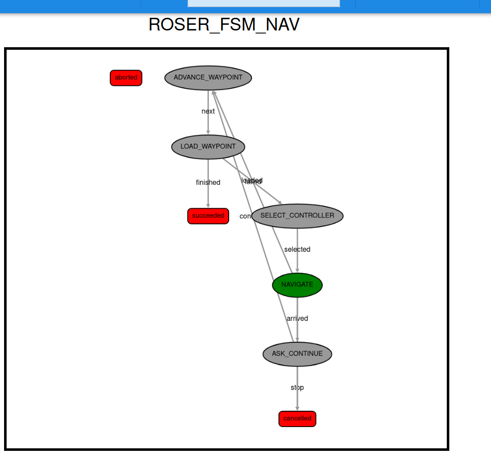
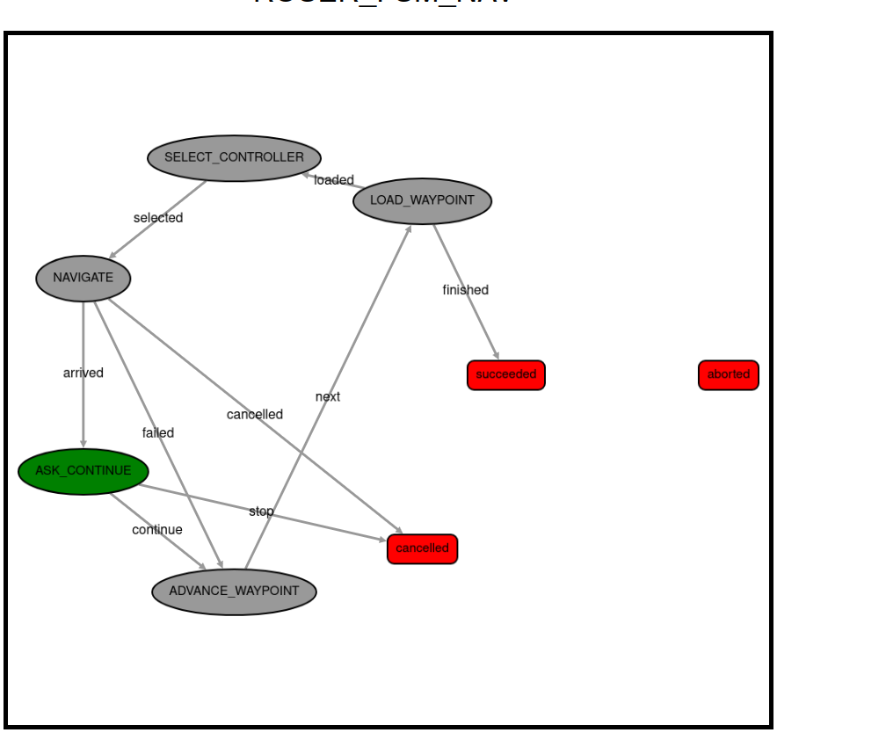

SI EMPEZAMOS DE 0
# Cerramos todo lo anterior
killall -9 gzserver gzclient rviz2

# Compilamos y lanzamos
cd /home/evagonz/Documents/MASTER/CUATRI2/ROCOG/yasmin/copiaPractFinalRoser/practicaFinalRoSer
colcon build --symlink-install
source install/setup.bash
ros2 launch practicas_nav_pkg navegacion_completa.launch.py

SI solo hemos cerrado y abierto vscode: 

# Compilamos y lanzamos
cd /home/evagonz/Documents/MASTER/CUATRI2/ROCOG/yasmin/copiaPractFinalRoser/practicaFinalRoSer

source install/setup.bash

export TURTLEBOT3_MODEL=burger
ros2 launch practicas_nav_pkg navegacion_completa.launch.py


## Guía de Ejecución: Navegación con Waypoints

Pasos en terminales separadas para iniciar el sistema y ejecutar la misión de navegación.

### 1. Iniciar el Entorno (Gazebo + RViz + Nav2)
En la primera terminal, lanza el simulador y el sistema de navegación:

```bash
# Navegar al espacio de trabajo
cd /home/evagonz/Documents/MASTER/CUATRI2/ROCOG/yasmin/copiaPractFinalRoser/practicaFinalRoSer

# Cargar el entorno
source install/setup.bash

# Exportar el modelo
export TURTLEBOT3_MODEL=burger

# Lanzar simulación completa
ros2 launch practicas_nav_pkg casaModerna.launch.py
```

### 2. Localización Inicial (Manual)
**IMPORTANTE:** Antes de ejecutar el script de navegación, el robot debe estar localizado en el mapa.
1. Ve a la ventana de **RViz**.
2. Haz clic en el botón **"2D Pose Estimate"** de la barra superior.
3. Haz clic y arrastra en el mapa sobre la posición donde aparece el robot en **Gazebo**.
4. Verifica que los errores de la terminal desaparezcan y el robot esté bien posicionado.

### 3. Ejecutar el Script de Misión
Una vez que el sistema está localizado, abre una **segunda terminal** para enviar los objetivos:

```bash
# Navegar al espacio de trabajo
cd /home/evagonz/Documents/MASTER/CUATRI2/ROCOG/yasmin/copiaPractFinalRoser/practicaFinalRoSer

# Cargar el entorno
source install/setup.bash

# Lanzar el navegador de puntos
ros2 run practicas_nav_pkg navegador_puntos.py
```

### 3.1. Ejercicio 6: Navegacion con FSM (YASMIN)

Para ejecutar la version con maquina de estados finita:

```bash
# Navegar al espacio de trabajo
cd /home/evagonz/Documents/MASTER/CUATRI2/ROCOG/yasmin/copiaPractFinalRoser/practicaFinalRoSer

# Cargar YASMIN (FSM)
source /home/evagonz/Documents/MASTER/CUATRI2/ROCOG/yasmin/install/setup.bash

# Cargar el entorno
source install/setup.bash

# Lanzar la FSM de navegacion
ros2 run practicas_nav_pkg navegador_fsm.py
```

Estados de la FSM:
- LOAD_WAYPOINT
- SELECT_CONTROLLER
- NAVIGATE
- ASK_CONTINUE
- ADVANCE_WAYPOINT

Para visualizar estados y transiciones en tiempo real (YASMIN Viewer):

```bash
source /home/evagonz/Documents/MASTER/CUATRI2/ROCOG/yasmin/install/setup.bash
ros2 run yasmin_viewer yasmin_viewer_node
```

Abrir en navegador:
- http://localhost:5000

Nombre de la maquina publicada:
- ROSER_FSM_NAV






### Descripción del Proceso
El script realizará las siguientes acciones automáticamente:
* **Lectura de Waypoints**: Carga las coordenadas desde `config/waypoints.yaml`.
* **Espera Activa**: El script esperará hasta que Nav2 esté completamente activo antes de empezar.
* **Modo Secuencial**: El robot visitará los 5 puntos (Entrada, Salón, Cocina, Habitación 1 y Despensa) en orden.
* **Modo Aleatorio**: El robot visitará los puntos en un orden aleatorio.

# 4. Desarrollo y Resolución de Problemas Técnicos

El despliegue del sistema de navegación autónoma presentó diversos retos técnicos. A continuación, se detallan los problemas encontrados durante la integración de Gazebo, RViz y Nav2, así como las soluciones aplicadas.

## 3.1. Sincronización entre el Mundo Físico (Gazebo) y el Mapa (RViz)
* **Problema**: Al inicio, el simulador Gazebo cargaba el entorno por defecto (`empty_world`), mientras que RViz mostraba el mapa de la casa personalizada. Esta falta de coincidencia hacía que el robot fuera incapaz de localizarse, ya que sus sensores láser no detectaban las paredes que el mapa de RViz indicaba. 
* **Dificultad en la investigación**: Gran parte del tiempo se dedicó a investigar en foros y documentación oficial cómo vincular correctamente ambos entornos. Identificar qué archivo `.world` específico era el compatible con el modelo de la casa y localizar sus mapas correspondientes (.yaml y .pgm), ya que cualquier mínima discrepancia en las dimensiones del mundo hacía que la localización fallara.
* **Solución**: Tras una búsqueda exhaustiva, se editó el archivo de lanzamiento `navegacion_completa.launch.py` para forzar la carga del mundo exacto. Se verificó que el servidor de mapas (`map_server`) apuntara al archivo `.yaml` generado durante la fase de SLAM, logrando finalmente una scoincidencia entre la física del simulador y la representación lógica del mapa.

## 3.2. Activación de Plugins de Sensores y Modelo del Robot
* **Problema**: El robot aparecía en la simulación, pero no publicaba datos en el tópico `/scan`. Sin lecturas del Lidar, el sistema de navegación no podía generar los mapas de costes (Costmaps) ni detectar obstáculos en tiempo real.
* **Solución**: El problema residía en la ausencia de las variables de entorno necesarias para que los plugins de ROS 2 en Gazebo identificaran el modelo de hardware. Se resolvió exportando el modelo antes del lanzamiento con el comando `export TURTLEBOT3_MODEL=burger`. Esto permitió que el `robot_state_publisher` cargara correctamente el archivo URDF y activara el sensor láser. Después ya se añadió directamente a la lógica y no hace falta lanzar el comando explícito.

## 3.3. Resolución de Errores de Transformada (TF) y Localización
* **Problema**: RViz reportaba errores críticos en los *Global Costmap*, indicando que no existía una transformada entre los marcos de referencia `map` y `odom`. El robot aparecía desubicado en un origen desconocido.
* **Solución**: Se utilizó la herramienta **"2D Pose Estimate"** en RViz para indicar al algoritmo **AMCL** la posición aproximada del robot. Al mover el robot levemente mediante teleoperación, el filtro de partículas de AMCL convergió, estableciendo la transformada necesaria y activando la planificación de rutas.

## 3.4. Precisión de Waypoints y Radio de Inflado
* **Problema**: Durante las primeras pruebas de navegación, el robot intentaba atravesar paredes o se bloqueaba en bucles de recuperación al intentar entrar en pasillos estrechos como la "Habitación 1".
* **Solución**: Se ajustaron manualmente las coordenadas en el archivo `waypoints.yaml` basándose en lecturas reales de RViz. Además, se revisó el `inflation_radius` en los parámetros de Nav2 para asegurar que el "colchón de seguridad" del robot le permitiera cruzar puertas estrechas sin detectar colisiones falsas.

## 3.5. Sincronización de Audio y Reconocimiento de Voz
* **Problema**: El robot comenzaba a escuchar demasiado pronto tras reproducir el mensaje de confirmación (“Dime si continúo”), captando su propia voz por el micrófono y detectando falsamente un “sí”, por lo que continuaba la misión sin intervención del usuario.
* **Solución**: Se reestructuró la función de escucha para separar claramente la reproducción del mensaje y el inicio de la captura de audio. Para ello, se movió la frase de la pregunta fuera de la función de escucha, se añadió una pequeña espera (sleep) antes de activar el reconocimiento, y se reconstruyó el paquete con colcon build para asegurarse de que los cambios en el script Python se reflejaran en la versión ejecutada. Esto evitó que el robot se “escuchara a sí mismo” y permitió que solo reaccionara a la respuesta del usuario.

